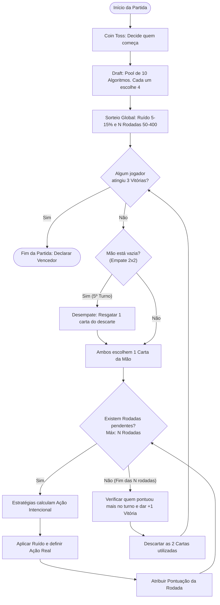

# Desafio 2: O Torneio com Estado, Ruído e Banco de Dados

## Objetivo
Evoluir o sistema do torneio do Dilema do Prisioneiro. O foco agora deixa de ser o consumo de dados externos (API) e passa a ser o **Gerenciamento de Estado** e a **Persistência de Dados**. Você deverá orquestrar partidas completas com novas regras (Draft, Ruído, Rodadas Dinâmicas e Turnos em "Melhor de 5") e modelar um banco de dados relacional capaz de armazenar o histórico granular do jogo para gerar relatórios analíticos.

## 1. As Regras de Negócio (Mecânica da Partida)

Uma partida agora ocorre entre dois jogadores (Players) e segue o fluxo exato abaixo. Como você já dominou a lógica de rodadas no desafio anterior, este é o fluxo de execução esperado para o código do jogo:

### A. A Biblioteca e o Draft (Sorteio)

* A biblioteca interna terá **10 algoritmos diferentes** cadastrados e disponíveis para o jogo.
* Cada jogador terá uma "mão" de apenas **4 cartas** (4 algoritmos).
* A partida começa com um *Coin Toss* (cara ou coroa) virtual para decidir qual jogador escolhe a primeira carta.
* A seleção de cartas deve ser alternada e balanceada a partir da biblioteca de 10 opções (ex: Jogador 1 escolhe uma estratégia, Jogador 2 escolhe outra, etc.) até que ambos tenham 4 cartas exclusivas para aquela partida.

### B. Variáveis Globais da Partida (Ruído e Rodadas)

Para cada partida iniciada, o sistema deve sortear duas variáveis que afetarão todo o jogo:

1. **O Ruído (Noise):** Um nível de ruído estático variando entre **0.05 e 0.15 (5% a 15%)**. É a chance de uma falha de comunicação ocorrer na rodada. Se o ruído agir, a ação intencional do algoritmo é invertida (se ele decidiu `COOPERATE`, o sistema executa e registra `DEFECT`, e vice-versa).
2. **A Quantidade de Rodadas (N):** O número de rodadas que cada duelo irá durar não é fixo. O sistema deve sortear um valor entre **50 e 400**, obrigatoriamente seguindo uma progressão aritmética de 50 em 50 (Ou seja, as opções são: *50, 100, 150, 200, 250, 300, 350 ou 400*).

### C. Os Turnos (Formato "Melhor de 5")

* O jogo agora é disputado em formato **Melhor de 5**. O primeiro jogador a vencer **3 turnos** ganha a partida (logo, uma partida pode acabar no 3º, 4º ou 5º turno).
* Em cada turno, os jogadores selecionam 1 carta de suas mãos. Essas duas cartas se enfrentam em um duelo de **N Rodadas** consecutivas. A matriz de pontuação clássica (3/3, 5/0 e 1/1) continua valendo para cada rodada.
* O vencedor do turno é a carta que somou mais pontos após as N rodadas.
* Após o turno, as cartas utilizadas são **descartadas**.
* **Regra de Desempate (O 5º Turno):** Como os jogadores só têm 4 cartas, se a partida chegar a um empate de 2 a 2, as mãos estarão vazias. Neste caso, para jogar o turno final, cada jogador tem o direito de escolher e **resgatar uma carta já descartada** para o embate final.

---

## 2. O Desafio Técnico (Banco de Dados e Relatórios)

Você não usará APIs neste desafio. As funções base (gerador de ruído, cara ou coroa, a biblioteca com os 10 algoritmos e a classe genérica de Player) serão fornecidas por um pacote interno que eu irei disponibilizar.

O seu trabalho principal é **modelar o banco de dados** e criar a lógica que orquestra e salva os passos do fluxograma acima. O seu banco de dados deve ser detalhado o suficiente para responder, via consultas (Queries SQL), às seguintes perguntas de negócio ao final das execuções:

### Visão Global (Overview)

1. Quais são os jogadores registrados no sistema?
2. Quantas partidas completas foram jogadas e salvas no banco até o momento?

### Estatísticas dos Jogadores (Leaderboard)

3. Qual é o jogador com o maior número de vitórias de partidas acumuladas?
4. Histórico de Vítimas: Para o jogador com mais vitórias, contra quais jogadores ele conquistou essas vitórias? (Ex: *Player A venceu: Player B (2x), Player C (1x)*).

### Estatísticas dos Algoritmos (O Meta-Game)

5. **O Maior Pontuador:** Qual algoritmo fez mais pontos no somatório de **todas** as partidas e rodadas registradas no banco?
6. **Melhor Matchup:** Dado um algoritmo X (ex: *Always Cooperate*), qual foi o algoritmo oponente que obteve a maior média de pontos jogando contra ele?

---

## 3. Entregáveis e Prazos

Para garantir que você aplique a regra do "Binóculo Invertido" e entenda o problema antes de codificar a solução, a entrega será dividida em duas partes:

* **Entrega 1 (Planejamento):** Antes de escrever qualquer lógica no código, você deve me apresentar o **Diagrama de Entidade-Relacionamento (ERD)** do banco de dados. Você precisará me explicar como a sua modelagem garante que a intenção original do algoritmo não seja perdida quando o "Ruído" agir, e como suas tabelas se conectam para responder às perguntas do relatório.
* **Entrega 2 (Execução):** O código funcional que roda as partidas de forma automatizada, salva tudo no banco e os scripts SQL (ou métodos no código) que extraem o "Dashboard" de relatórios.
